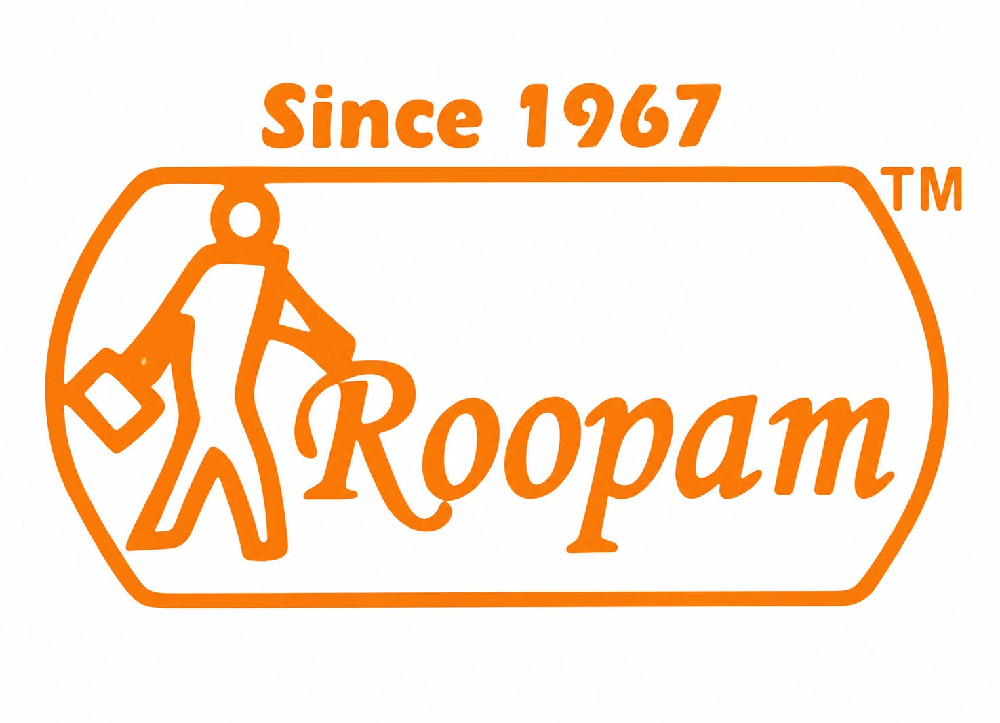
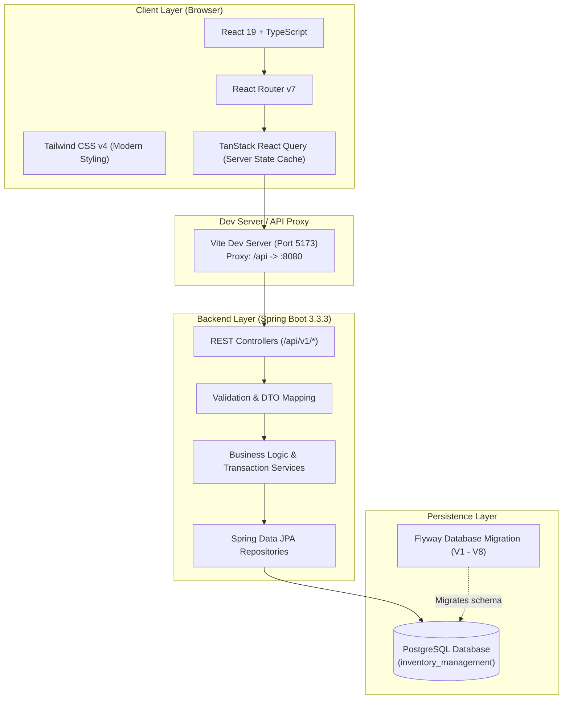

<div align="center">



# Roopam — Custom Bag Retail & ERP Management System

[](https://www.oracle.com/java/)
[](https://spring.io/projects/spring-boot)
[](https://www.postgresql.org/)
[](https://react.dev/)
[](https://www.typescriptlang.org/)
[](https://vitejs.dev/)
[](https://tailwindcss.com/)
[](https://flywaydb.org/)

**A modern, full-stack Enterprise Resource Planning (ERP), Point of Sale (POS), and Interactive Custom Bag Builder tailored for Roopam Retail.**

[Features](#-key-features) • [System Architecture](#-system-architecture) • [Tech Stack](#-technology-stack) • [Database & Migrations](#-database-schema--migrations) • [Quick Start](#-getting-started) • [API Reference](#-api-endpoints-overview) • [Project Structure](#-project-structure)

---

</div>

## 📌 Overview

**Roopam** (established in 1967) is a heritage retail brand specializing in travel gear, school bags, executive backpacks, rainwear, and bespoke leather/canvas accessories. 

This project is an all-in-one digital transformation platform providing:
1. **Interactive Custom Bag Customizer** — An online 2D studio allowing customers and store clerks to configure custom bags (type, fabric, compartments, straps, custom name embossing, and accessory add-ons) with instant dynamic pricing calculation.
2. **Retail Inventory & Stock Audit Engine** — Complete stock tracking with strict ledger transactions (`IN`, `OUT`, `ADJUSTMENT`) to eliminate stock discrepancies.
3. **Point of Sale (POS) & Sales Management** — Fast counter billing with automatic sequential invoice generation (`INV-YYYYMMDD-XXXX`), multiple payment modes, cancellations, and restock handling.
4. **Procurement & Supplier Management** — Supplier directory with multi-contact channels, Purchase Order (PO) creation (`PO-YYYYMMDD-XXXX`), and flexible instalment payment tracking.
5. **Business Intelligence & Reporting** — Real-time analytics covering daily revenue, category-wise performance, fast-moving items, and cancelled sale tracking.

---

## ✨ Key Features

### 🎒 1. Interactive Custom Bag Studio
- **Dynamic 2D Visualizer**: Live interactive preview matching user-selected dimensions, silhouettes, colors, and branding badges.
- **Parametric Configuration**:
  - **Styles**: Backpack, Laptop Bag, Sling Bag, Travel Bag, Tote Bag
  - **Dimensions**: Small, Medium, Large
  - **Materials**: Heavy Canvas, Ripstop Polyester, Tactical Nylon, Genuine Leather
  - **Hardware & Straps**: Standard, High-Density Padded, Ergonomic Adjustable
  - **Compartments**: 1 to 4 customizable partitioned sections
  - **Enhancements**: Water resistance coating, laptop shock padding, bottle holster, custom embroidered name tag.
- **Live Price Estimator**: Transparent costing breakdown with automated bill calculation based on base model + material tier + add-ons.
- **Instant Quotation & Order Generation**: Save custom specifications for production handoff.

### 📦 2. Inventory & Stock Tracking
- Real-time stock counts by SKU and variant.
- Immutable transaction audit log recording timestamp, transaction type, quantity diff, and reference document.
- Safety stock alerts and zero-stock locks during checkout to prevent overselling.

### 💳 3. Point of Sale (POS) & Sales Workflow
- Barcode/SKU quick lookup and keyboard-friendly checkout flow.
- Support for split and multi-mode payments: **Cash, Card, UPI, Bank Transfer**.
- Full sales order lifecycle management: Completed, Edited, and Cancelled with reason tracking and automated stock reversion.

### 🚚 4. Procurement & Supplier Relations
- Comprehensive supplier database supporting multiple emails and phone numbers per vendor.
- Multi-item Purchase Orders with automatic tax and line-item total calculations.
- Vendor payment ledger tracking paid amounts, pending balances, and instalment schedules.

### 📊 5. Analytics & Reports
- Executive dashboard with daily revenue, transaction count, average order value (AOV), and top-selling categories.
- Date-range filtering and custom report exports.

---

## 🏛 System Architecture



---

## 🛠 Technology Stack

### Backend
| Technology | Version | Purpose |
| :--- | :--- | :--- |
| **Java** | 21 (LTS) | Core application platform |
| **Spring Boot** | 3.3.3 | Enterprise backend framework |
| **Spring Data JPA / Hibernate** | 3.3.3 | ORM and persistence abstraction |
| **Spring Validation** | 3.3.3 | Declarative Jakarta bean validation |
| **PostgreSQL** | 14+ / 16 | Relational database storage |
| **Flyway** | 10.x | Incremental database schema versioning |
| **Maven** | 3.9+ | Build and dependency management |

### Frontend
| Technology | Version | Purpose |
| :--- | :--- | :--- |
| **React** | 19.2 | Declarative component UI library |
| **TypeScript** | 6.0 | Strict type safety and DX |
| **Vite** | 8.2 | Next-generation frontend tooling and HMR |
| **Tailwind CSS** | 4.3 | Utility-first responsive styling |
| **TanStack React Query** | 5.102 | Async state management and caching |
| **React Router** | 7.18 | Client-side routing and layout rendering |
| **Lucide React** | 1.43 | Modern icon suite |
| **Axios** | 1.20 | HTTP client with response interceptors |

---

## 🗄 Database Schema & Migrations

The database schema is strictly versioned using **Flyway**. Migrations run automatically on application startup:

- `V1__initial_schema.sql` — Categories, Brands, Products core schema with foreign keys and unique constraints.
- `V2__add_case_insensitive_product_identifiers.sql` — Unique index handling for case-insensitive product names and SKUs.
- `V3__create_inventory_transactions_table.sql` — Inventory ledger table tracking `IN`, `OUT`, and `ADJUSTMENT` operations.
- `V4__create_suppliers_tables.sql` — Vendor tables, multi-email (`supplier_emails`), and multi-phone (`supplier_phones`) mapping.
- `V5__create_purchase_management_tables.sql` — Purchase orders, purchase item lines, and vendor payment records.
- `V6__harden_purchase_constraints.sql` — Database constraints ensuring balance integrity and status consistency.
- `V7__create_sales_management_tables.sql` — Sales invoices, line items, customer payment records, and audit history logs.
- `V8__seed_development_data.sql` — Idempotent master seed data (categories, sample brands, products, and suppliers) for instant development setup.

---

## 🚀 Getting Started

### Prerequisites
Before running the project locally, ensure you have the following installed:
- **Java 21 JDK** ([Eclipse Temurin](https://adoptium.net/) or [Oracle JDK](https://www.oracle.com/java/technologies/downloads/))
- **Node.js** (v18.0 or later) & **npm**
- **PostgreSQL Server** (v14 or later)
- **Git**

---

### Step 1: Clone the Repository
```bash
git clone https://github.com/shub262005/custom-bag-retail.git
cd custom-bag-retail
```

---

### Step 2: Database Setup
1. Create a PostgreSQL database named `inventory_management`:
```sql
CREATE DATABASE inventory_management;
```
2. Verify the database credentials in `src/main/resources/application.properties` or set environment variables:
```properties
spring.datasource.url=jdbc:postgresql://${DB_HOST:localhost}:${DB_PORT:5432}/${DB_NAME:inventory_management}
spring.datasource.username=${DB_USERNAME:postgres}
spring.datasource.password=${DB_PASSWORD:admin}
```

> **Tip:** You can also pass these via environment variables (`DB_HOST`, `DB_PORT`, `DB_NAME`, `DB_USERNAME`, `DB_PASSWORD`) without altering the configuration file.

---

### Step 3: Run the Backend (Spring Boot)
In the root directory, start the Spring Boot backend using the Maven wrapper:

**On Linux/macOS:**
```bash
./mvnw spring-boot:run
```

**On Windows (PowerShell / Command Prompt):**
```powershell
.\mvnw.cmd spring-boot:run
```

The backend server will start on **`http://localhost:8080`**. Flyway will automatically apply all database migrations and seed baseline development data on first run.

---

### Step 4: Run the Frontend (Vite + React)
Open a separate terminal window and navigate to the `frontend` folder:

```bash
cd frontend
npm install
npm run dev
```

The frontend application will start on **`http://localhost:5173`**.

> All requests to `/api` from Vite are automatically proxied to `http://localhost:8080`.

---

## 📡 API Endpoints Overview

All backend endpoints are scoped under `/api/v1`:

| Area | HTTP Method | Endpoint | Description |
| :--- | :--- | :--- | :--- |
| **Products** | `GET` | `/api/v1/products` | List products with optional status filtering |
| | `POST` | `/api/v1/products` | Create a new product (validates SKU uniqueness) |
| | `GET` | `/api/v1/products/search?q={query}` | Search by product name, SKU, or description |
| | `GET` | `/api/v1/products/{id}` | Get product details by ID |
| | `PUT` | `/api/v1/products/{id}` | Update product details |
| | `PATCH` | `/api/v1/products/{id}/status` | Activate/Deactivate product |
| **Categories** | `GET` | `/api/v1/categories` | Retrieve active & inactive categories |
| | `POST` | `/api/v1/categories` | Create category |
| **Brands** | `GET` | `/api/v1/brands` | List bag and accessory brands |
| | `POST` | `/api/v1/brands` | Create new brand |
| **Suppliers** | `GET` | `/api/v1/suppliers` | List all registered suppliers |
| | `POST` | `/api/v1/suppliers` | Register new supplier with contacts |
| **Inventory** | `GET` | `/api/v1/inventory-transactions` | View stock transaction history |
| | `POST` | `/api/v1/inventory-transactions` | Record manual adjustment or intake |
| **Purchases** | `GET` | `/api/v1/purchases` | Filter purchase orders by vendor, date, status |
| | `POST` | `/api/v1/purchases` | Create PO with auto-generated order code |
| | `POST` | `/api/v1/purchases/{id}/payments` | Add installment payment to purchase |
| | `PATCH` | `/api/v1/purchases/{id}/cancel` | Cancel purchase order |
| **Sales & POS** | `POST` | `/api/v1/sales` | Create sale / checkout invoice |
| | `GET` | `/api/v1/sales` | Query sales with date and payment method filters |
| | `PATCH` | `/api/v1/sales/{id}/cancel` | Cancel sale and restock inventory |
| | `GET` | `/api/v1/sales/dashboard` | Key metric summary for sales |
| | `GET` | `/api/v1/sales/reports/daily` | Detailed daily revenue report |

---

## 📂 Project Structure

```
custom-bag-retail/
├── src/                               # Spring Boot Backend Source
│   ├── main/
│   │   ├── java/com/inventory/inventorymanagement/
│   │   │   ├── controller/            # REST API Controllers (Product, Sale, Purchase, etc.)
│   │   │   ├── dto/                   # Request & Response Data Transfer Objects
│   │   │   ├── entity/                # JPA Domain Entities & Enums
│   │   │   ├── exception/             # Global Exception Handler & Custom Errors
│   │   │   ├── repository/            # Spring Data JPA Data Repositories
│   │   │   └── service/               # Core Business Logic & Generators
│   │   └── resources/
│   │       ├── application.properties # Spring configuration (DB, Flyway, Hibernate)
│   │       └── db/migration/          # Version-controlled SQL migrations (V1 to V8)
│   └── test/                          # Unit & integration test suites
│
├── frontend/                          # Vite + React Frontend
│   ├── public/                        # Static assets, SVG icons, and logos
│   ├── src/
│   │   ├── api/                       # Axios client instance & error parser
│   │   ├── components/                # Reusable UI system (Table, Modal, Button, etc.)
│   │   ├── context/                   # Global Toast & Notification Context
│   │   ├── features/                  # Domain-driven feature modules
│   │   │   ├── brands/                # Brand management
│   │   │   ├── categories/            # Category management
│   │   │   ├── custom-bag/            # Interactive 2D customizer & pricing logic
│   │   │   ├── inventory/             # Stock list & ledger history
│   │   │   ├── products/              # Product catalog & CRUD
│   │   │   └── suppliers/             # Vendor list & contact forms
│   │   ├── pages/                     # Routed view pages (POS, Dashboard, Reports, etc.)
│   │   ├── types/                     # TypeScript shared interfaces
│   │   ├── utils/                     # Currency, date, and string formatting
│   │   ├── App.tsx                    # Route definitions & app layout
│   │   └── main.tsx                   # React root entry point
│   ├── index.html                     # HTML5 root template
│   ├── package.json                   # Frontend dependencies & scripts
│   └── vite.config.ts                 # Vite setup with API proxy
│
├── image.png                          # Roopam Since 1967 official badge
├── pom.xml                            # Maven build specification
└── README.md                          # Project documentation
```

---

## 🔒 Quality & Data Integrity

- **Flyway Baseline Management**: Schema state is tracked and verified before startup, preventing schema drift across environments.
- **Transactional Consistency**: All inventory deductions, sale insertions, and purchase order modifications run within `@Transactional` boundaries.
- **Auditing**: Every critical operation (sale cancellation, inventory alteration) triggers an immutable audit entry recording user actions and reasons.

---

## 📜 License

This project is developed as an academic capstone and enterprise management platform for **Roopam**.  
All rights reserved © 2026.
